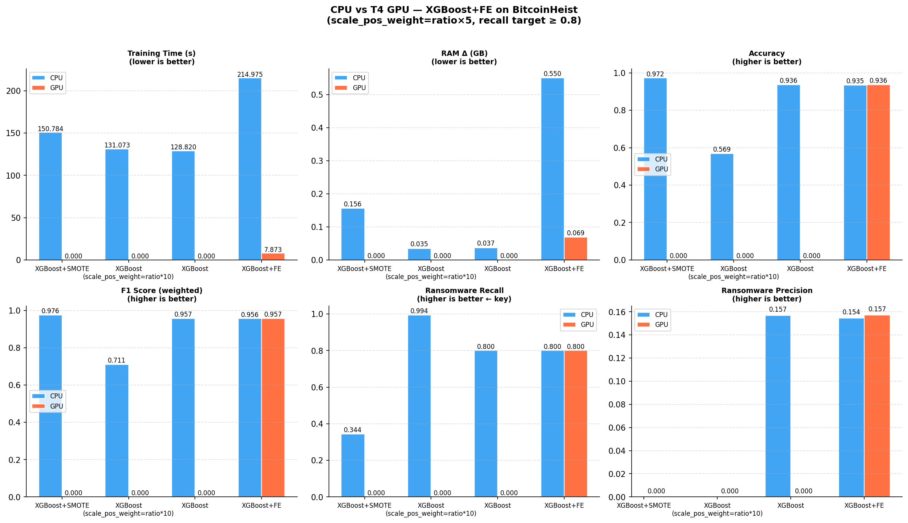
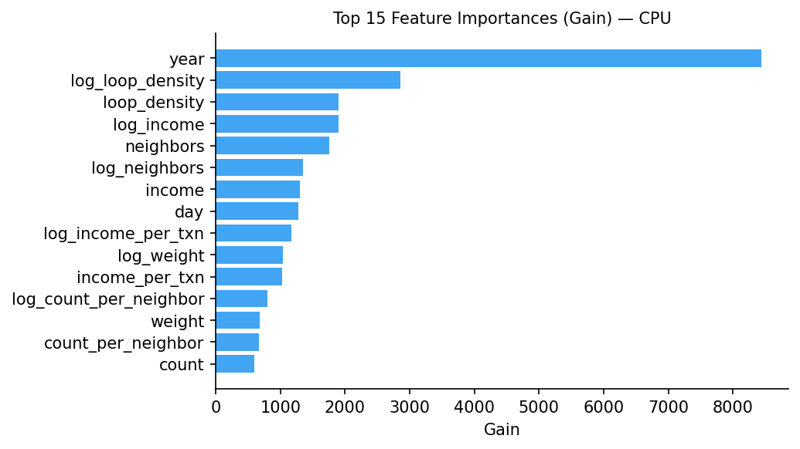
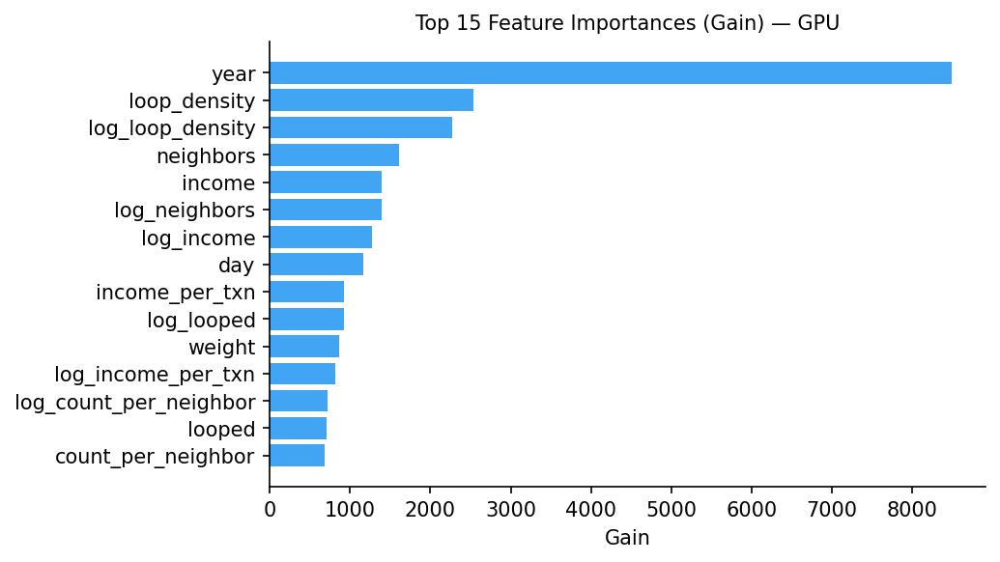
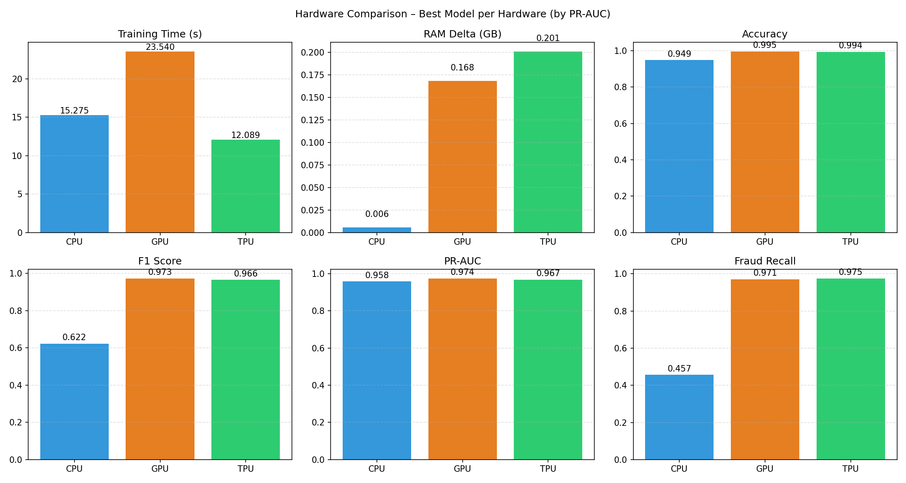

<div align="center">

# CPU-GPU-TPU ML Benchmark Suite

[](https://www.python.org/)
[](LICENSE)
[](https://jupyter.org/)
[](https://colab.research.google.com/)

A notebook-based benchmark framework for evaluating CPU, GPU, and TPU performance on machine learning workloads.

**Performance at a Glance**

[](#results-summary)
[](#results-summary)
[](#results-summary)

</div>

## Table of Contents

- [Overview](#overview)
- [Repository Structure](#repository-structure)
- [Benchmark Workstreams](#benchmark-workstreams)
- [Environment Setup](#environment-setup)
- [Google Colab Execution](#google-colab-execution)
- [Results Summary](#results-summary)
- [Visual Highlights](#visual-highlights)
- [Reproducibility Guidance](#reproducibility-guidance)
- [Troubleshooting](#troubleshooting)
- [Contributing](#contributing)
- [License](#license)

## Overview

This repository contains two benchmark workstreams designed to compare model performance and resource utilization across CPU, GPU, and TPU runtimes:

1. Chartalist: Bitcoin/ransomware classification benchmarking
2. DeFiTransLyzer: DeFi fraud detection benchmarking

Each workstream is implemented as a Jupyter notebook and produces structured outputs in CSV and PNG formats.

## Repository Structure

```
cpu-gpu-tpu-ml-benchmark/
├── Chartalist/
│   ├── Dataset/
│   │   └── data.txt
│   ├── Notebook/
│   │   └── Chartalist_CPU_GPU_Comparison_1.ipynb
│   └── Results/
│       ├── comparison_results.csv
│       ├── speedup_table.csv
│       ├── bitcoin_cpu_gpu_comparison.png
│       ├── confusion_matrix_CPU.png
│       ├── confusion_matrix_GPU.png
│       ├── feature_importance_CPU.png
│       └── feature_importance_GPU.png
├── DeFiTransLyzer/
│   ├── Dataset/
│   │   └── defi_fraud_clean.zip
│   ├── Model/
│   │   └── optimised_lightgbm.pkl
│   ├── Notebook/
│   │   └── DeFi_Fraud_Detection_CPU_vs_GPU_TPU.ipynb
│   └── Results/
│       ├── comparison_results.csv
│       ├── comparison_results_best.csv
│       ├── comparison_results_optimised.csv
│       ├── hardware_comparison_metrics.csv
│       ├── speedup_table.csv
│       └── hardware_comparison.png
├── requirements.txt
└── README.md
```

## Benchmark Workstreams

### Chartalist: BitcoinHeist Classification

- Notebook: `Chartalist/Notebook/Chartalist_CPU_GPU_Comparison_1.ipynb`
- Observed dataset dimensions: 2,916,697 records x 10 columns
- Feature engineering expansion: 8 -> 26 features
- Observed class imbalance ratio (legitimate:ransomware): 69.43
- Final comparison model: XGBoost+FE

### DeFiTransLyzer: DeFi Fraud Detection

- Notebook: `DeFiTransLyzer/Notebook/DeFi_Fraud_Detection_CPU_vs_GPU_TPU.ipynb`
- Runtime comparison includes CPU, GPU, and TPU
- Output artifacts include performance metrics, speedup tables, and hardware comparison visualizations

## Environment Setup

### Local Execution

```bash
git clone https://github.com/aysh34/cpu-gpu-tpu-ml-benchmark.git
cd cpu-gpu-tpu-ml-benchmark
python -m venv venv
# Windows PowerShell:
venv\Scripts\Activate.ps1
pip install -r requirements.txt
jupyter notebook
```

## Google Colab Execution

Direct Colab links:

- Chartalist:
  <https://colab.research.google.com/github/aysh34/cpu-gpu-tpu-ml-benchmark/blob/main/Chartalist/Notebook/Chartalist_CPU_GPU_Comparison_1.ipynb>
- DeFiTransLyzer:
  <https://colab.research.google.com/github/aysh34/cpu-gpu-tpu-ml-benchmark/blob/main/DeFiTransLyzer/Notebook/DeFi_Fraud_Detection_CPU_vs_GPU_TPU.ipynb>

Recommended initialization cell:

```python
!git clone https://github.com/aysh34/cpu-gpu-tpu-ml-benchmark.git
%cd cpu-gpu-tpu-ml-benchmark
!pip install -r requirements.txt
```

Optional Google Drive mount:

```python
from google.colab import drive
drive.mount('/content/drive')
```

## Results Summary

### Chartalist: CPU vs GPU (XGBoost+FE)

Execution context reported:

- CPU runtime: XGBoost 3.2.0 | PyTorch 2.10.0+cpu
- GPU runtime: XGBoost 3.2.0 | PyTorch 2.10.0+cu128
- GPU device: Tesla T4 (14.6 GB VRAM)

Benchmark outcomes:

| Hardware | Training Time (s) | RAM Delta (GB) | Accuracy | Ransomware Recall | Ransomware Precision | Threshold | Features |
| -------- | ----------------: | -------------: | -------: | ----------------: | -------------------: | --------: | -------: |
| CPU      |          214.9750 |         0.5499 |   0.9349 |            0.8000 |               0.1544 |    0.9082 |       26 |
| GPU      |            7.8729 |         0.0688 |   0.9363 |            0.8000 |               0.1572 |    0.9083 |       26 |

Measured training-time acceleration:

- XGBoost+FE: 214.975s -> 7.873s (27.31x speedup)

Reported artifact paths:

- `/content/drive/MyDrive/bitcoin_hw_comparison/comparison_results.csv`
- `/content/drive/MyDrive/bitcoin_hw_comparison/speedup_table.csv`
- `/content/drive/MyDrive/bitcoin_hw_comparison/feature_importance_CPU.png`
- `/content/drive/MyDrive/bitcoin_hw_comparison/feature_importance_GPU.png`
- `/content/drive/MyDrive/bitcoin_hw_comparison/confusion_matrix_CPU.png`
- `/content/drive/MyDrive/bitcoin_hw_comparison/confusion_matrix_GPU.png`

### DeFiTransLyzer: CPU vs GPU vs TPU

Reported model metrics:

| Hardware    | Accuracy | Precision | Recall |     F1 | PR-AUC | ROC-AUC | False Positive Rate | False Negative Rate |
| ----------- | -------: | --------: | -----: | -----: | -----: | ------: | ------------------: | ------------------: |
| CPU         |   0.9921 |    0.9423 | 0.9751 | 0.9585 | 0.9545 |  0.9944 |              0.0061 |              0.0249 |
| GPU         |   0.9950 |    0.9746 | 0.9709 | 0.9728 | 0.9735 |  0.9955 |              0.0026 |              0.0291 |
| TPU (v5e-1) |   0.9936 |    0.9569 | 0.9750 | 0.9659 | 0.9671 |  0.9953 |              0.0045 |              0.0250 |

Reported training-time speedup table:

| Hardware | Time (s) | Speedup vs CPU |
| -------- | -------: | -------------: |
| CPU      |  15.2747 |           1.00 |
| GPU      |  23.5402 |           0.65 |
| TPU      |  12.0895 |           1.26 |

Reported artifact paths:

- `/content/drive/MyDrive/defi_hw_comparison/hardware_comparison.png`
- `/content/drive/MyDrive/defi_hw_comparison/speedup_table.csv`

## Visual Highlights

### Chartalist: CPU vs GPU Comparison

<p align="center">
  
</p>

**Key Visual Insight**: GPU execution reduced training time from 214.9750s (CPU) to 7.8729s, corresponding to a measured 27.31x speedup, while preserving comparable detection performance.

### Chartalist: Feature Importance

<table>
  <tr>
    <td align="center"><strong>CPU</strong></td>
    <td align="center"><strong>GPU</strong></td>
  </tr>
  <tr>
    <td></td>
    <td></td>
  </tr>
</table>

**Key Visual Insight**: Feature ranking patterns remain consistent between CPU and GPU runs, indicating that acceleration improved runtime efficiency without materially changing model interpretability.

### DeFiTransLyzer: CPU vs GPU vs TPU Comparison

<p align="center">
  
</p>

**Key Visual Insight**: In this benchmark configuration, TPU achieved the fastest training time (12.0895s, 1.26x vs CPU), while GPU runtime (23.5402s, 0.65x vs CPU) was slower than the CPU baseline.

## Reproducibility Guidance

For high-fidelity reproduction:

1. Use the same notebook and runtime type in Colab (CPU, GPU, or TPU).
2. Install dependencies from `requirements.txt` before execution.
3. Keep preprocessing and threshold-selection logic unchanged.
4. Save outputs to a fixed, versioned path for traceability.

Minor metric variation across repeated executions is expected due to runtime and hardware scheduling differences.

## Troubleshooting

- GPU not detected in Colab:
  - Runtime -> Change runtime type -> Hardware accelerator -> GPU
- TPU not detected in Colab:
  - Runtime -> Change runtime type -> Hardware accelerator -> TPU
- Google Drive write errors:
  - Re-run `drive.mount('/content/drive')` and validate destination folder path
- Missing packages:
  - Re-run `pip install -r requirements.txt`

---

## Contributing

Contributions are welcome.

1. Fork the repository.
2. Create a feature branch.
3. Update notebooks and corresponding result artifacts.
4. Open a pull request with a concise summary of changes and metrics.

## License

This project is licensed under the MIT License.
